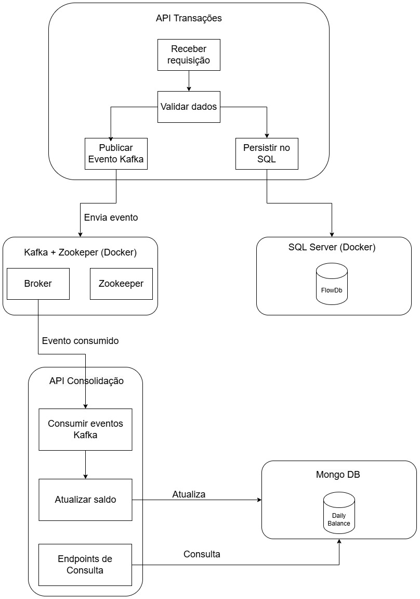

# Flow - Sistema de Transações e Saldo Diário

Este projeto consiste em duas APIs que trabalham juntas para processar transações financeiras e consolidar saldos diários.

### 🏗 Arquitetura do Sistema


1. **API de Transações** (`Flow.Services.Transactions`)
   - Registra transações financeiras em um banco de dados SQL Server.
   - Após salvar a transação, publica uma mensagem no Apache Kafka para processamento assíncrono.
2. **API de Consulta de Saldo Diário** (`Flow.Services.DailyBalance`)
   - Consome mensagens do Kafka e consolida os dados no MongoDB.
   - Disponibiliza um endpoint para consultar o saldo diário das transações processadas.

---

## 🚀 Tecnologias Utilizadas

- **.NET 8** - Framework principal das APIs.
- **SQL Server** - Banco de dados para armazenar transações.
- **MongoDB** - Banco de dados para armazenar o saldo consolidado.
- **Kafka** - Mensageria para comunicação entre os serviços.
- **Docker** - Utilizado para rodar instâncias do SQL Server e MongoDB.

---

### 1️ Subindo os Bancos de Dados com Docker

Na raiz do projeto, há um arquivo `docker-compose.yml`. Para subir os bancos de dados necessários, execute:

```sh
docker-compose up -d
```

Isso iniciará o SQL Server, MongoDB e o Kafka, conforme configurado no arquivo.

### 2 Configurando a API de Transações

1. Navegue até a pasta `Flow.Services.Transactions` e abra o arquivo `appsettings.json`.
2. Verifique se as configurações do SQL Server e Kafka estão corretas.
3. Execute a API:

```sh
dotnet run
```

### 3 Configurando a API de Saldo Diário

1. Navegue até a pasta `Flow.Services.DailyBalance` e abra o arquivo `appsettings.json`.
2. Verifique se as configurações do MongoDB estão corretas.
2. Rode a API:

```sh
dotnet run
```

---

## Migrations

As migrations do banco de dados são versionadas e criadas automaticamente utilizando o FluentMigrator. Não é necessário criar migrations manualmente. Certifique-se de que as configurações do FluentMigrator estão corretas para garantir a execução das migrações durante a inicialização do sistema. As versões estão na pasta Flow.Infra/Migrations/Versions

---

## 🔑 Autenticação

Para chamar a API de transações, é necessário autenticar-se.

📌 **Credenciais Padrão** (SeedData incluído):

```json
{
  "username": "admin",
  "password": "admin"
}
```

### Obtendo Token JWT

Para obter o token de autenticação, faça uma requisição `POST` para:

```sh
POST api/login
```

Corpo da requisição:

```json
{
  "username": "admin",
  "password": "admin"
}
```

O retorno será um token JWT, que deve ser enviado no cabeçalho das requisições:

```sh
Token: <seu_token_aqui>
```

---

## 📖 Endpoints Disponíveis

### 📌 API de Transações

1. **Criar Transação**
   - **Endpoint:** `POST /api/transactions`
   - **Corpo:**
   - **Type: 1-Crédito, 2-Débito**
   ```json
   {
     "value": 100.0,
     "type": 1
   }
   ```
   - **Resposta:** `201 Created`

### 📌 API de Saldo Diário

2. **Consultar Saldo Diário**
   - **Endpoint:** `GET /api/dailybalance?date=2024-02-20`
   - **Resposta:**
   ```json
   {
     "id": "67b729b78927ebc7dd5133fc",
     "date": "2024-02-20",
     "totalBalance": "70"
   }
   ```

---

## 🧪 Testando a Aplicação

### 1️⃣ Criando uma Transação

```sh
curl -X 'POST' \
  'http://localhost:5283/api/Transaction' \
  -H 'accept: */*' \
  -H "Authorization: Bearer <seu_token_aqui>" \
  -H 'Content-Type: application/json' \
  -d '{
  "value": 100,
  "type": 1
}'
```

### 2️⃣ Consultando o Saldo Diário

```sh
curl -X 'GET' \
  'http://localhost:5237/api/Consolidated/2025-02-20' \
  -H 'accept: */*'
```

---

## Testes

O projeto inclui testes para os casos de uso (UseCases) e validações (Validators). Para executar os testes, utilize o seguinte comando:

```sh
  dotnet test
```

Os testes garantem que as principais funcionalidades, como a execução de transações e validações de entrada, funcionem corretamente.

Exemplos de testes implementados:

UseCases: Teste de execução de transações simulando a interação com repositórios.

Validators: Teste de validação de transações, verificando valores inválidos e tipos incorretos.

## 🚨 Possíveis Problemas e Soluções

### ❌ Erro de conexão com o SQL Server

🔹 **Solução**: Certifique-se de que o contêiner do SQL Server está rodando e que o `appsettings.json` tem a string de conexão correta.

### ❌ Erro de Kafka não encontrado

🔹 **Solução**: O Kafka deve estar rodando antes de iniciar as APIs.

---


